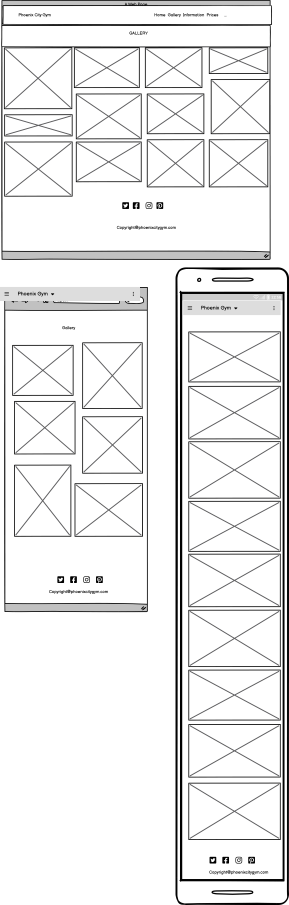
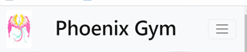
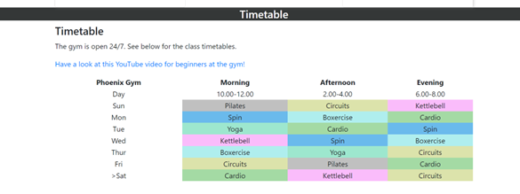
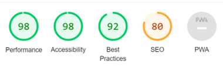
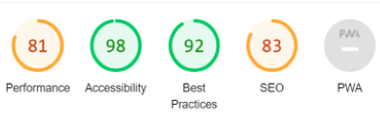
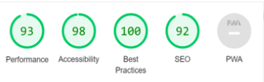
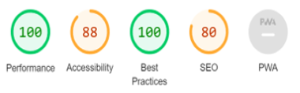
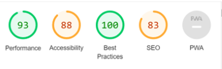

# Phoenix Gym

## Site Overview

The project aim is to develop a website for a new campaign to attract clientele to a gym located in Cardiff.  The target audience is for a diverse section of the general public and pays attention to diversity (pictures of people of different ages, different cultures and body sizes).  The project provides pages to showcase particular features of the gym, including the equipment, staff, personal trainers and the benefits of joining a gym.  Included is a price list of different categories of membership, as well as a timetable to provide information on different classes provided.  Included is a map so that potential customers can easily locate the gym.

## Table of Contents

1.  [Site Overview](#site-overview)
2.  [Planning Stage](#planning-stage)
     *  [Target Audience](#target-audience)
     *  [User  Stories](#user-stories)
     *  [Site Aims](#site-aims)
     *  [Wireframes](#wireframes)
     *  [Colour Scheme](#colour-scheme)
     *  [Typography](#typography)
3.  [Current Features Common to all pages](#current-features-common-to-all-pages)
      * [The Header Element:](#navigation-bar)
      * [The Rest of the Features](#the-landing-page)
      * [Footer](#footer)
4.  [Future-Enhancements](#future-enhancements)
5.  [Testing Phase](#testing-phase)
6.  [Deployment](#deployment)
7.  [Tech](#tech)
8.  [Credit](#credit)
      * [Honorable mentions](#honourable-mentions)
      *  [General reference](#general-reference)
      *  [Content](#content)
      *  [Media](#media)

## Planning Stage

### Target audience

* As a user, I want to see the websites subject matter; namely what the gym has to offer.
* As a user, I want to be able to navigate the pages and website to find what I require quickly and easily.
* As a user, I want to learn more about what the business offers in a clear way including the times the gym is open; the classes and a clear pricing system.
As a user, I want to be able to contact the business and know where the gym is located.
User stories

### User Stories

#### First time Visitor goals:-

* As a First Time Visitor, I want to easily understand the main purpose of the site and learn more about the organisation.
*  As a First Time Visitor, I want to be able to easily navigate throughout the site to find content.
*  As a First Time Visitor, I want to look for testimonials to understand what their users think of them and see if they are trusted. I also want to locate their social media links to see their followings on social media to determine how trusted and known they are.

#### As a Returning Visitor 

* I want to find specific information about current prices and class timetables.
*  As a Returning Visitor, I want to find information on how the facilities available and links to social media.
*  As a frequent user I would want to have an emailed newsletter once a month to update me on any activities, challenges at the gym.

### Site Aims

*  To inform the user of the opening times and location
*  To inform the users about what is on offer when they are in the gym
*  To offer the user an opportunity to contact the gym with a telephone number and email address.

### Wireframes:

* Wireframes were developed in Balsamiq.  The following link to open the file:-

Wireframes for Desktop, Tablet and Mobile

*  Landing Page

*  

*  Gallery Page

* 

* Information Page

* 

*  Locatiion Page

* 

Gallery Page

### Colour Scheme:

*  The colour scheme chosen for the website was taken from the "Hero-Image" used in the Home Page which used bright colours, to attract the attention of the user.  This was combined with a white navigation bar and black headings on a white background to provide an uncluttered effect and does not clash with other black and white images used throughout the website.  This provided a clear contrast between the text, background and images.

#### Colour values

All colour values have been converted to their Hex equivalent.

*  The background colour is white #fff which provides a contrast to the black header and bright colours used in images.

*  The black header colour #000000. contrasts with the bright images and picks blends with the black and white images.

* The label has a background value of background-color #924587 to provide opacity.  

*  The Home (active) button has a colour value of #9fd1e6; which picks up colour form the Hero-Image and colour images and contrasts with the black and white images.

*  The Hover button has a colour value of 

###  Typography 

#### Fonts

The fonts used throughout the website includes: -

*  The Roboto font and the Sans Serif font.

* The Roboto font has been designed specifically for screen use to balance reading comfort with content density.  The font is said to be web-friendly and reportedly renders well on modern web browsers as well as older browser versions to provide maximum quality of text for users.

*  The fonts were sourced from Google fonts, as stated in the credits.
  
#### Images

*  Imagery is important to the project,
*  The website's appeal is to show the transformative effect of joining a gym for a leaner, stronger body shape, better health and more confidence.  This is achieved with the use of photographs throughout the website showing the use of gym equipment
*  A diverse section of images has been used for age, race, gender and size.
*  Bright images have been used on the Landing Page and black and white images have been interspersed throughout the website.

## Current Features Common to all pages

### Header Element

### Navigation Bar

####

Navigation Bar for Wide Screens

Navigation Bar Collapsed for Small Devices

The Navigation bar provides user access to all the pages and is consistent across the website.  It provides: -

* The user with links to each page of the website
* All the links provide the navigation to each page.  
* The Home page is highlighted so that the users is aware of their position and how to return to the Home Page.
*	On smaller screens a hamburger menu, vertically aligned is provided to ensure mobile users have an optimal experience
*  The navigation bar is fixed at the top of the page and so is accessible to the user as they scroll down the page.

#### Address

*  The address for the gym is featured on the first and last pages.
*  The content includes a telephone number and email address so that the user is able to contact the gym for more information.
*  On each page are social media links.

### Footer

*  Social network links provide access to Facebook, Twitter, YouTube, Instagram and Pinterest

## The Rest of the features

###  Landing Page

*  The Landing Page provides an animation of people of gym bikes. The animation provides movement suggesting energy.  The image is bright and depicts people already using a gymnasium.

* The transformation  provides four circular images.  The use of cropped circular images allows the designer to crop out uneccessary pixels and to refocus the user's eye on the composition.  The circular images responsively scale down.

### Gallery Page

* The gallery allows users to see several images clearly at once to showcase the benefits of the gym.
* The gallery images are responsive and are accessible on screens of different sizes so no information is lost for those using smaller screens.

### Information Page

* Content cards were used to display the prices of different memberships.  The cards are responsive and resiseable so the information is not lost on different screens.

#### Timetable

*  A responsive, colourful timetable provides easy access to classes available at the gym.  

###  Location Page

*  The Location page provides the user with information about public transport links and car parking facilities.

*  A Google Map provides the user with an interactive map to pinpoint the exact location of the gym.

## Future-Enhancements

At the time of designing this website I lacked the skills to provide certain features that would be included in a future website.  The features that I would include are: -

*  An integrated shopping cart where users could join the gym via the website.
*  Bookable classes:  The timetable linked to a database and paying system/membership type.  The timetable would feature a pop out informing the user of how many spaces were currently avaialabe and the staff member running the class.  If a class is full the user would be informed of this and asked it they would like to book the next available one. If the class isn't full a button would be available to book a class.
*  A specific mobile stylesheet would be developed around the website which would include the features to join and book classes for users on smaller screens.
*  Customer review integration. User reviews have been found to influence buying behaviours.   User reviews would be incorporated for free publicity, build trust and reliability, showcase current and new features, advocate and build brand awareness, improve engagement and user interaction, boost management approval.
*  Once users have paid a membership form would be implemented outlining their membership status, start date, end date, date of next payment and rules and regulations about the use of equipment and behaviour inside the gym.
*  The booking system would be also be implemented whereby when users pay, they could book a one-to-one induction with a staff member.
*  Social media links would be implemented for news, images and user stories linked to Facebook, Instagram, Twitter, Pinterest and YouTube.
*  An area where the last newsletter can be downloaded where it has previously been sent out monthly to current members with the inclusion of special deals and providing an introduction to new staff and information on new classes.
*  A form email enquiry would be implemented into the website so that users could send and receive requests for information.
*  A more accessible user design for use with assisted technology.
*  The footer would be further utilized by having copyright information and terms and conditions
*  Images will be stored in in an external environment such as Flickr and not in the root folder. For commercial purposes a paid content service would be implemented such as Amazon AWS Storage.

## Testing Phrase

The website was tested via the Dev Tools in Google Chrome including Lighthouse.  Below are screenshots of the performance, accessibility and best practice for each page.  

##### The Landing Page

Destop Result

Mobile Result

##### The Gallery

Desktop Performance

Mobile Performance

##### The Information Page

Desktop Performance

Mobile Performance

##### The Location Page

Desktop Performance

Mobile Performance

* The performance in the Dev Tools, Lighthouse extension for the desktop Landing Page was better than for mobile.  This is an area that would need improvement.  While developing the website the suggested issues were targeted, however, issues then became prevailant in W3 Schools HTML Validator and so were taken out.  
*  The Gallery Page was mostly made up of images and the performance reflected this in both mobile and desktop mode.
*  The Information Page result was better for desktop mode over mobile.  This is an area where the developer needs to concentrate on future developments.
*  The Location Page was poor for accessibility and this is an area to focus on for future developments.  Further investigation would be to integrate a map with an API key.
*  The responsivemess across multiple device screens was tested with the "I am responsive" application.
*  Chrome Dev Tools was used to check the css file.  The result was that a vertical image was unnecessary.  However, at the time of writing this the developer has failed to find the snippet of code.

####Other Testing

* Friends and family tested the site out on their PC's, laptops, tablets and mobile phones and to report back any bugs.

*  The website was tested on Internet Explorer, Microsoft Edge and Safari browsers.

*  The website was tested on a variety of devices including iPhone 14, Samsung Galaxy Note 20.

#### Validation

The W3 Schools website was used to validate the HTML pages and Jigsaw for the css pages.

##### Bugs

Drop of CSS formatting in Address
*  Problem
     *  The address css code would not format the HTML page.  The formatting would reappear indisciminately.  
*  The Cause
     The Chrome Developer tools and Jigsaw Validitator for css were used to look for errors.
* The Fix
     *  The problem was a missed curly brace.

Active Link not Staying Set
*  Problem
    *  The active page should have stayed coloured when a page was clicked
*  The Cause
     *  The css code was not implemented 
*  The Fix
     *  The css file was updated with the correct formatting for a class

##  Tech

Frameworks, Libraries & Programs Used

HTML5
CSS3
Bootstrap 4
Coolers
Font Awesome
JQuery
Git
GitHub
Google Fonts
NCH Pixillion
Lighthouse
Balsamiq
Chrome Dev Tools
W3 Schools HTML Validator
W3 Schools Jigsaw CSS Markup Validator

*  The website was written in HTML5 and CSS3.
*  Bootstrap4 with JQuery was used to provide responsiveness and styling for smaller screens. 
* Hover.css was used on the navigation bar and the Social Media icons in the footer. 
*  Google fonts was used for Roboto font and Sans-serif was used as a backup if Roboto was not compiled.
*  Font Awesome was implemented throughout the website.
*  Git was used for version control by utilizing the Gitpod terminal to commit to Git and Push to GitHub.
*  GitHub has been used to store the project code after being pushed from Git.
*  NCH Pixillion was used to change the format of the images into AVIF
*  Coloors: The colors website was used to check colour compatbility..
* Lighthouse was used in Chrome Dev Tools via Chrome Incognito mode to test responsiveness in "Desktop" and "Mobile".  
*  Balsamiq was used to create the wireframes during the design process.
 
##  Deployment

I deployed the page on GitHub pages via the following procedure: -​

*  In the project's repository, go to the settings tab.
Navigate to the left-hand menu and select the Pages tab.
*  Select the Main branch from under the Source section drop-down menu and click save.
*  A message will be visible to indicate a successful deployment to Github pages and this will provide a live link.  The website can be found via the following URL

## Honourable Mentions

### Credits

A massive thank you to my mentor, Richard Wells for all his help and guidance. I don't think I would have completed it without your knowledge and guidance.  A very big thank you to everyone in the Slack community for answering all my questions!.

### Content:

* The full-screen hero code came from the Code Institute project "Love Running", including the code for the hero-image animation and the cover text overlay.

### Media

Pictures were used from the websites below where they were free to use under a non-commercial licence.

 Adobe Free Images
+ Adobe Free images - users' own Adobe Library via the link below
  *  [Adobe](https://shared-assets.adobe.com/link/36c38f09-8417-4075-6832-6ce80ec91823)

Unsplash
*  Unsplash Free Images 
   *  [Unsplash](https://unsplash.com)

Freepiks
*  Freepiks Free Images
    *  [Freepiks](https://www.freepik.com/)

#### Bootstrap4: 

*  The Bootstrap Library used was used throughout the project to cut down on time, and to make the website more responsive for a "mobile first" initiative in building the website.

#### Google Maps:  

*  A link to a fictitious Gym has been created via Google maps which includes a fictitious address.

#### HTML Validation:  

*  The HTML files were validated through the W3 Schools HTML Validation process

*  Content
      * All content was written by the developer.  Where ideas from other software has been 
        included acknowledgment has been documented in the HTML files and in this project document.

